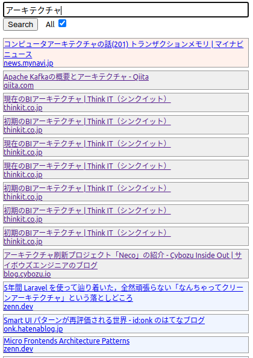

# misc finder

Scrapbox、はてなブックマーク、zenn.devのいいねした投稿、ブラウザの履歴、ブックマークから一気に検索するChrome拡張機能。

## 使い方

1. Scrapboxとはてなのサービスにログインする（この拡張機能は、ブラウザでログインしているユーザのデータに対して検索します）。
2. この拡張機能をChromeにインストールする。
   1. このリポジトリをローカルにダウンロード後、
   2. ``npm install``
   3. ``npm run build``
   4. Chromeの拡張機能の管理画面から "Load unpacked" をクリックし、distディレクトリを指定
3. 拡張機能のオプション画面で、Scrapboxのプロジェクト名を登録（**複数設定可能**）
4. Ctrl+Shift+F または アイコンをクリックすることで検索フォームを表示する。
5. テキストボックスに検索クエリを入力して、ボタンをクリックすると、検索結果が表示される。

検索結果の項目の色分けは以下の通り:
* オレンジ: ブックマーク
* 灰色: 履歴
* 緑: Scrapbox
* 水色: はてなブックマーク
* 薄紫: zenn.com

「All」のチェックボックスを付けると上記全てから検索。
付けないと、Scrapboxのみから検索。

* はてなブックマークとScrapboxは全文検索（APIの仕様そのまま）
* 履歴とブックマークはタイトルとURLに対する検索（ChromeのAPIを利用）

## 他に検索したいもののアイデア
* GitHubのスターしたリポジトリ
* Tweets, liked tweets
* HackerNewsのupvote, submitした記事
* Qiita: stock、自分の記事
* Zenn: 自分の記事
* Google (custom) search
* ローカルファイルの検索 (ローカルに別途プログラムをインストールすれば実装可能と思われる)
  * ローカルのファイルを検索するなら拡張機能にしないほうがいいのだが、Scrapboxに認証のAPIが現状無いようなので、ブラウザでログインしてもらう形式にした。

## ぱっと思いつく現状の問題点
* 履歴とブックマークに対するand検索ができない（はてブとscrapboxはデフォルトでAnd検索される）
* マイナス検索ができない
* 検索結果の表示順序が不定
* incremental searchができない
* コード中の日本語が化ける (ので日本語は書いていない)
* 色で識別させるのはユーザビリティ的によくない
